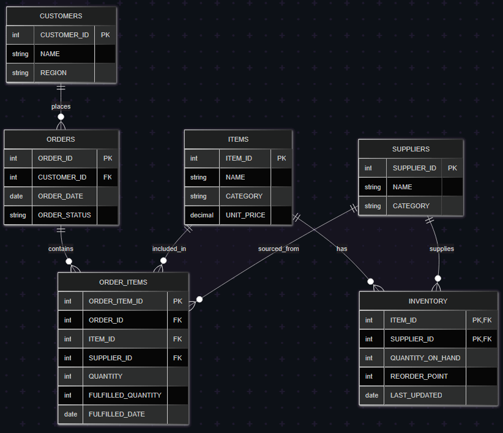

Methodology
===========

The simulation operates on a discrete-event, time-based model, progressing through a series of random but weighted events over a specified number of iterations. From there data is exported for analysis and visualisation.

1.  **Initialisation**:

    -   A PostgreSQL database connection is established.

    -   Synthetic data for `Suppliers`, `Items`, and `Customers` is generated using the `Faker` library, ensuring realistic names, categories, and regions.

    -   Initial `Inventory` levels are populated in the database, linking items to eligible suppliers based on categories and setting random reorder points.

    - An ERD (Entity Relationship Diagram) of the database:

    

2.  **Simulation Loop**:

    -   The simulation time advances by a random small increment in each iteration.

    -   One of four events is randomly chosen to occur:

        -   **Order Creation**: A new customer order is generated with a random selection of items and quantities. This order is recorded in the `ORDERS` and `ORDER_ITEMS` tables with an initial 'unfulfilled' status.

        -   **Order Fulfillment**: The system attempts to fulfill a randomly selected unfulfilled item from an existing order. Fulfillment success depends on supplier reliability (failure rate) and available `Inventory`. If successful, `QUANTITY_ON_HAND` in `INVENTORY` is reduced, `FULFILLED_QUANTITY` in `ORDER_ITEMS` is updated, and the overall `ORDER_STATUS` is adjusted (e.g., to 'partial' or 'fulfilled').

        -   **Inventory Restocking**: Items whose `QUANTITY_ON_HAND` falls below their `REORDER_POINT` become eligible for restocking. The restock chance for each item is influenced by their restock weight and if chosen their quantity is restocked to the suppliers maximum quantity, updating the `INVENTORY` table.

        -   **Idle**: No specific action occurs, representing periods of inactivity.

    -   Error handling is in place to catch and report issues during event execution.

3.  **Periodic Updates & Logging**:

    -   Every 100 iterations, the simulation performs maintenance tasks:

        -   The cache of unfulfilled orders is refreshed.

        -   Old orders (older than 14 simulated days) that are still 'unfulfilled' or 'partial' are marked as 'expired' or 'partial - expired'.

        -   Recent fulfillment attempts are flushed from a temporary buffer to the main `order_fulfillment_log`.

        -   A snapshot of the current `Inventory` state, including `QUANTITY_ON_HAND` and `backlog_unfulfilled_qty` are recorded in `inventory_history`.

        -   Database changes are committed.

4.  **Data Export**:

    -   Upon completion of all iterations, the accumulated `inventory_history` and `order_fulfillment_log` are exported to `inventory_history.csv` and `fulfillment_log.csv` files, respectively. These CSVs provide a comprehensive dataset for subsequent analysis.

5.  **Basic EDA**:

    Data Loading & Glimpse: Imported main files (orders, order_items, inventory_history, etc.) and examined data types and distributions.

    **Visualisations**:
    - Order Status Breakdown

    - Fulfillment Outcome Breakdown

    - Fulfillment Attempt Success

    These steps laid the groundwork for deeper modeling by highlighting patterns and failure modes.

6. **Modelling and Deeper Analysis**:

    **A. Data Preparation**

    Created `order_item_final` with enriched fields:

    - `avg_quantity_on_hand`, `avg_backlog`, `stockouts`

    - Item and supplier configuration parameters from `simulation_config.json`

    - Binary indicator `fulfilled_binary`

    Reduced to **supplier–item pairs**, aggregated across orders:

    - Dropped irrelevant columns (IDs, dates, statuses)

    - Grouped by `supplier_id` & `item_id`

    - Averaged numeric columns using `dplyr::summarise(across(...))`

    **B. Modeling Fulfillment Rate vs. Inventory**

    **Linear regression**:

    `avg_fulfilled_rate ~ avg_quantity_on_hand`

    - Strong positive coefficient (p ≈ 5e‑9), **R² ≈ 0.30**

    - Residuals well-behaved; uplifting model baseline.

    - Confirmed inventory’s critical role in fulfillment outcomes.

    **C. Modeling Inventory via Config & Dynamics**

    - **Full linear model**:

        - Predictors: `item_failure_rate`, `item_restock_weight`, `supplier_failure_rate`, `supplier_fulfillment_weight`, `avg_backlog`, `stockouts`

        - **Key findings**:

            - `item_restock_weight`: strongest predictor (p < 2e‑16)

            - `stockouts`: strong negative relation (p < 2e‑5)

            - `avg_backlog`: mild positive effect (p ≈ 0.025)

            - Supplier params mostly non-significant

        - **Model fit**: R² ≈ 0.91

    - **Polynomial model** (degree 2):

        - Nonlinear component of `item_restock_weight` significant

        - R² improved to ≈ 0.94, residual SD reduced

    - **Random Forest**:

        - Confirmed variable importance:

            1. `item_restock_weight`

            2. `stockouts`

            3. `avg_backlog`

        - Supplier-level parameters had marginal importance

    These results demonstrate that **item-level restock logic and dynamic metrics (stockouts/backlog)** are the principal drivers of inventory, explaining subsequent fulfillment outcomes.

**7. Key Insights & Causal Flow**

- **Causal sequence established**:
    - `item_restock_weight` ↑ → `avg_quantity_on_hand` ↑ → `avg_fulfilled_rate` ↑
    - Conversely: `stockouts` ↑ → `avg_quantity_on_hand` ↓ → `fulfillment` ↓

- **Supplier-level config parameters** (failure rate, fulfillment weight) are less predictive than item dynamics.

- **Intervention focus**: tuning item-level restocking strategy and managing stockouts/backlogs will yield better fulfillment performance.

**8. Power BI Visualisations**

The processed datasets (`order_item_final` and `supplier_item_df`) were loaded into Power BI Desktop for interactive exploration and storytelling of the causal chains identified in modelling. Three main report pages were developed:

**A. Scatter Chart Analysis Pages**
- Three separate scatter charts exploring different variable pairings.
- Each chart includes a brief text description below, highlighting notable patterns in the data.
- Three list slicers (`Supplier`, `Item Name`, `Item Category`) allow filtering across all charts for targeted exploration.

**B. Decomposition Tree Page**
- Visual breakdown of `avg_fulfilled_rate` by key influencing factors (`avg_quantity_on_hand`, `item_restock_weight`, `stockouts`).
- Supports drilling down through the causal chain to understand variable contributions.
- Linked interactions with a companion scatter chart enable detail filtering when nodes are selected.

**C. Tooltip Page**
- Contains six dynamic KPI cards (e.g., `Supplier`, `Item Name`, `Item Restock Weight`, `Stockouts`) that display context-specific details.
- These KPIs are triggered when hovering over data points in scatter charts on the previous pages, giving instant contextual insight without cluttering the main visuals.

The combination of scatter plots for pattern recognition, decomposition trees for causal explanation, and contextual tooltips for detail-on-demand creates a cohesive, interactive analytical experience that complements the statistical modelling.
