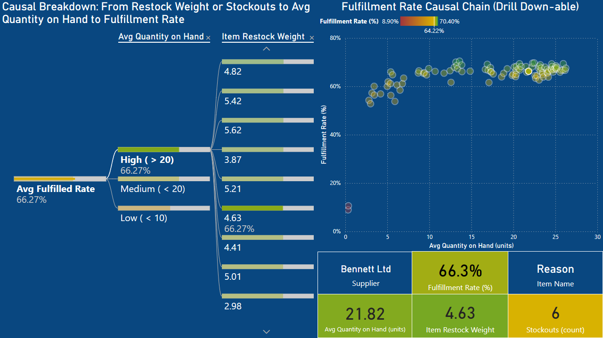

# Supply Chain Simulator

## Project Overview

The **Supply Chain Simulator** is a Python and R project that simulates realistic supply chain behavior—including customer ordering, supplier fulfillment, inventory tracking, and restocking logic. It interfaces with a PostgreSQL database to manage the state of all core entities.

The simulation generates detailed logs and inventory records, which are exported to CSV and used for **data-driven diagnostics** and **visualisations** on fulfillment performance.

### Key Features:

- **Database Schema**: PostgreSQL schema with normalised tables for items, customers, suppliers, orders, order items, and inventory.
- **Synthetic Data**: Uses `Faker` to generate semi-realistic data, enhanced by parameterised failure rates and restocking logic.
- **Event-Driven Simulation**: Simulates core supply chain events such as order creations, fulfillment attempts and restocks across thousands of iterations.
- **Data Persistence**: All entity states and transitions are stored in a relational database.
- **CSV Export**: Key simulation outputs (`inventory_history.csv`, `fulfillment_log.csv`) exported for downstream analysis.
- **Analysis and Visualisation**: Identifying and displaying the causal chain that is most predictive of order and order item failures.

---

## Analytical Objective

> **How many customer orders go partially or fully unfulfilled — and what inventory or supplier-related factors are driving these failures?**

This project uses simulation to create a rich dataset of fulfillment outcomes and inventory dynamics. These are then analysed to understand:
- What causes fulfillment success or failure
- How inventory levels and supplier/item configurations influence performance
- Which supplier–item combinations are most vulnerable

---

## Project Structure

<pre>
├── README.md
├── METHODOLOGY.md
├── LICENSE.txt
├── eda_baseline.ipynb
├── analysis_modelling.ipynb
├── config.py
├── database.py
├── models.py
├── data_generator.py
├── db_loader.py
├── simulation.py
├── main.py
├── .gitignore
├── images/
│ └── erd.png
├── data/
│   └── (sample CSVs and simulation outputs)
└── sql/
  └── create_tables.sql
  └── clear_data.sql
  └── drop_tables.sql
  └── integrity_tests.sql
  └── basic_eda.sql
</pre>


---

## Setup and Installation

### 1. Prerequisites

- Python 3.x
- PostgreSQL
- pip (Python package installer)

### 2. Clone the Repository

```bash
git clone https://github.com/JamesBuckley3/supply-chain-simulator.git
cd supply-chain-simulator
```

### 3. Set Up Python Environment

```bash
python -m venv venv
source venv/bin/activate   # On Windows: venv\Scripts\activate
pip install -r requirements.txt
```

Contents of `requirements.txt`:

```txt
psycopg2-binary
Faker
python-dotenv
pandas
matplotlib
```

### 4. Configure Database Connection

Create a .env file in the root directory:

```env
DB_NAME=supply_chain_sim
DB_USER=your_postgres_user
DB_PASS=your_postgres_password
DB_HOST=localhost
DB_PORT=5432
```

### 5. Set Up the Database

Run the SQL schema setup:

```bash
psql -U your_postgres_user -d supply_chain_sim -f sql/create_tables.sql
```

## Running the Simulation

Run the main script:
```bash
python main.py
```

This will:

- Generate synthetic data for suppliers, items, customers, and initial inventory

- Simulate 100k+ (or however many you choose) order fulfillment iterations

- Log fulfillment attempts and inventory states

- Export:

    - `fulfillment_log.csv`

    - `inventory_history.csv`

    - `simulation_config.json`

## Analysing the Data

The exported CSVs enable powerful diagnostic analytics.
### Exploratory Analysis (eda_baseline.ipynb)

- Visualised fulfillment outcomes by status (fully, partially, unfulfilled)

- Analysed time trends and supplier-level fulfillment patterns

- Created boxplots of config parameters (failure rates, restock weights)

### Modeling and Diagnostics (analysis_modelling.ipynb)

- Merged simulation config with fulfillment logs and inventory history

- Computed:

    - `avg_quantity_on_hand `(critical inventory metric)

    - `avg_fulfilled_rate` (by supplier–item pair)

- Built regression models:

    - Found `avg_quantity_on_hand` is the strongest predictor of fulfillment

    - Identified `item_restock_weight` and `stockouts` as key drivers of inventory levels

    - Used linear regression, polynomial models, and random forests for interpretability

Causal Flow Confirmed:

```nginx
item_restock_weight ↑  →  avg_quantity_on_hand ↑  →  avg_fulfilled_rate ↑
        stockouts ↑    →  avg_quantity_on_hand ↓  →  avg_fulfilled_rate ↓
```


*Decomposition tree page from `fulfillment_dashboard.pbix` showing relationships between inventory metrics and fulfillment rates.*

## Contributing

I welcome contributions! Feel free to fork, open issues, or submit pull requests.

## License

Licensed under the MIT License.